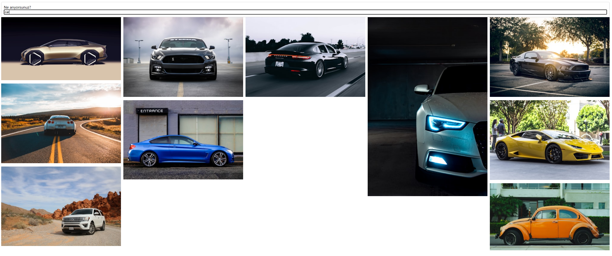

# 🖼️ Unsplash Image Search

This is a simple React application that allows users to search for images using the [Unsplash API](https://unsplash.com/developers). Users can type a keyword into the input field and get a responsive grid of images in return.

## 🚀 Features
- 🔍 Real-time image search with Unsplash API
- ⚛️ Built with React and functional components
- 📦 Axios for API requests
- 🎯 Clean and responsive layout with CSS grid
- 🔐 Optional environment variable support for API keys

## 📸 Preview




## 🛠️ Technologies Used
- React (Hooks)
- Axios
- Unsplash Developer API
- HTML & CSS 

## 📂 Project Structure
src/
├── components/
│ ├── ImageList.js
│ └── ImageItem.js
├── SearchHeader.js
├── App.js
├── index.js
└── App.css

## 🧪 Getting Started

### 📦 Installation

```bash
git clone https://github.com/yusuferenaykurtt/unsplash-image-finder.git
cd unsplash-image-finder
npm install
npm start

🌐 Usage
Go to http://localhost:3000

Type any keyword (e.g., "nature", "code", "car") into the search box

View the returned images from Unsplash

🔐 Setting Up Your Unsplash API Key
1.Create a .env file in the root of your project

2.Add your Unsplash API key like this:
REACT_APP_UNSPLASH_KEY=your_access_key_here

3.In src/api/unsplash.js, make sure you use:
Authorization: `Client-ID ${process.env.REACT_APP_UNSPLASH_KEY}`
⚠️ Don't forget to add .env to your .gitignore to keep your key private!

📄 License
MIT License © 2025 yusuferenaykurtt